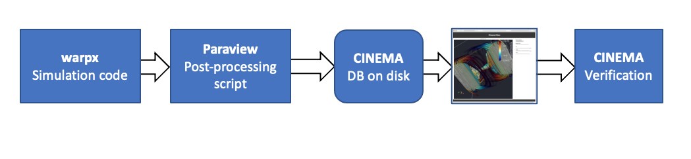

# WarpX example 

Diagram of workflow in this example.

This workflow exercises creating a post-processing cinema database, using 
[WarpX's](https://warpx.readthedocs.io/en/latest/install/hpc/summit.html)
latest build instructions.

## Using this repository

The workflow does the following:

- Creates a [Pantheon](http://pantheonscience.org/) environment and build location
- Clones and builds a specific commit of [Warpx](https://github.com/ECP-WarpX)
- Runs the workflow to produce data 
- Runs a script to post-process that data into a Cinema database
- Adds a `Cinema` viewer and a jupyter notebook viewer, and packages up the results.
- Verifies the `Cinema` database

First, clone the repository, then:

1. edit the `bootstrap.env` file to include your compute allocation ID and workflow path.
2. `./execute` will execute the workflow

## Notes on this repository

- Build instructions embedded in this workflow are derived from the build instructions for 
[WarpX's](https://warpx.readthedocs.io/en/latest/install/hpc/summit.html)
- This workflow will pull cached builds from a [E4S](https://e4s-project.github.io/) repository, if they exist
to speed up the build/install of requisite applications.
